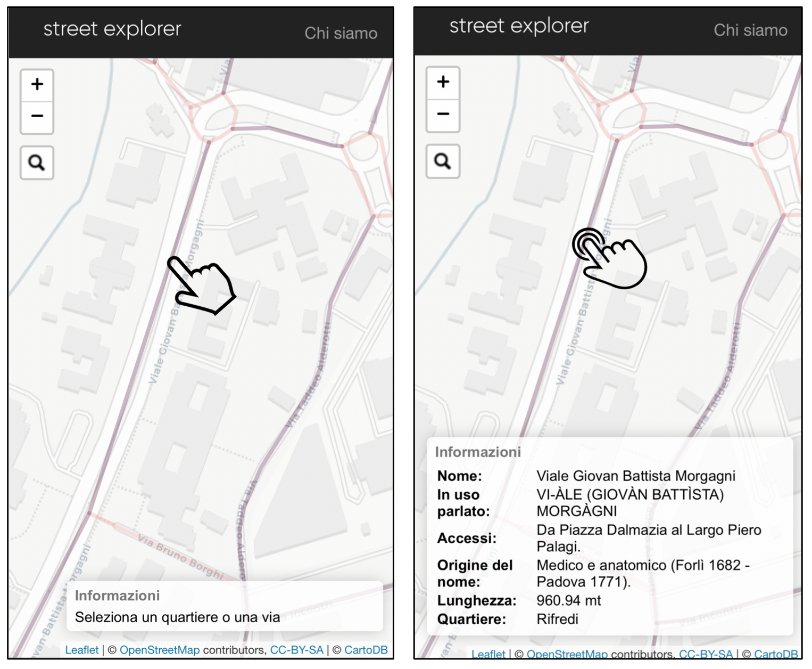
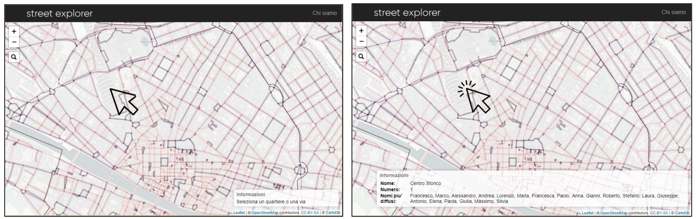
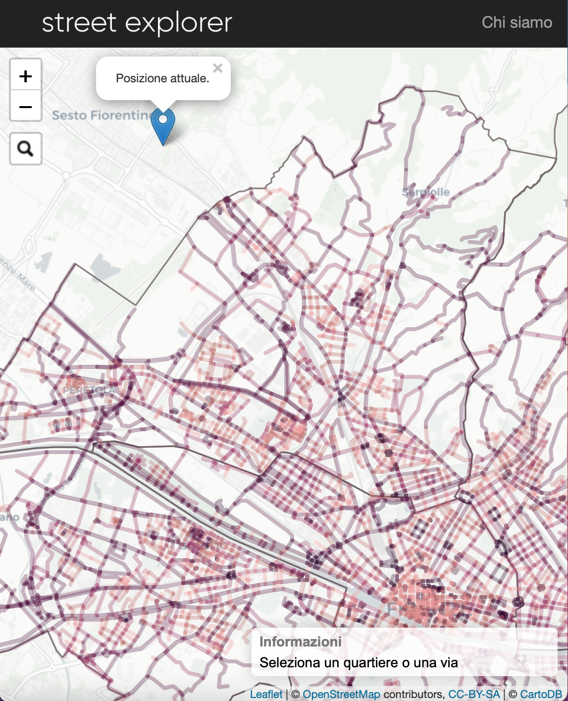
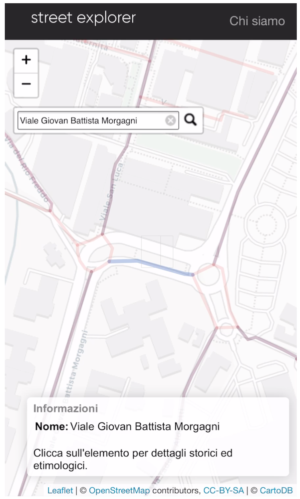

# Street-Explorer-Firenze

This Web application has been designed paying close attention to the rendering on both mobile and desktop devices. This allows the user to have a seamless experience across all their devices. Street Explorer | Firenze allows the navigation on an interactive map for the visualization of geolocalized information about the names of the historical streets of Florence as shown from the image below:

    <i> Information shown by clicking on a street:</i>

  

It is also possible to obtain information about the most common names of people in the Florentine districts by pressing on the corresponding district as presented on the following screen from the application:

    <i> Information about the district:</i>

  

Moreover, the application offers the visualization of the user's position and a search system through which it is possible to locate particular city streets and squares. The user is guided in the search through the convenient search bar that leads the user directly to the searched location:

    <i> User tracking location and search bar:</i>

  
  

## Authors
- Chiara Andreini
- [Claudia Raffaelli](https://github.com/ClaudiaRaffaelli)

## Acknowledgments
Multimedia Design and Production project (Progettazione e Produzione Multimediale) - Computer Engineering Bachelor Degree @[University of Florence](https://www.unifi.it/changelang-eng.html)

The datasets used are provided by the [Municipality of Florence](http://opendata.comune.fi.it). The realization of the interactive maps is achieved through the [Leaflet](https://leafletjs.com) library.
